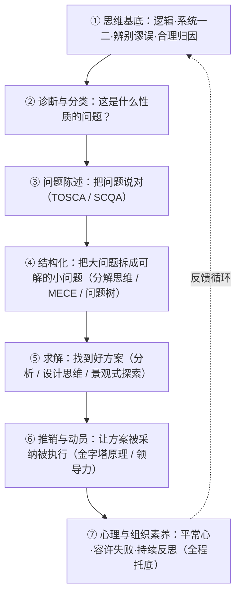

## 结构化学习笔记（基于 6 本解决问题经典著作）

> **一句话总纲**：解决问题不是靠"更努力"或"更聪明"，而是靠一套**分层的操作系统**——先用逻辑与诊断看清问题本质，再用分解/结构化把模糊大问题拆成可解的小问题，然后用分析、设计思维与进化式探索求出好方案，最后靠金字塔沟通与领导力动员让方案被采纳、被执行；全程由"平常心 + 容许失败 + 持续反思"的素养托底。


---

## 零、3 分钟速览（小白版，先读这个）

**用大白话说，这套系统就四句话：**

1. **先别急着动手**——大多数人失败在"解错了题"：把症状当病因、一上来就押宝某个方案、或者问题根本没定义清楚。
2. **把大问题拆小**——模糊的问题解不动，拆成不重复、不遗漏的小块（MECE）后，答案常常自己浮出来。
3. **找方案有讲究**——多列几个替代方案再挑；卡住时允许自己"先变糟再变好"、跨界借点子；验证最可疑的假设，而不是找支持自己的证据。
4. **方案好 ≠ 能落地**——要会讲（观点先行），难题还得动员一群人跟你一起干。

**微案例：奶茶店生意变差了，怎么办？**（把七步法走一遍）

| 步骤   | 做什么           | 一句话示范                                                                    |
| ---- | ------------- | ------------------------------------------------------------------------ |
| 1 澄清 | 分清目的/目标/问题/任务 | 问题="营业额比去年同期降 30%"，不是"生意不好"这种模糊感觉                                        |
| 2 诊断 | 问题分类          | 是"恢复原状型"（以前好现在差）→ 重点找原因                                                  |
| 3 陈述 | TOSCA         | 麻烦=营业额降三成；所有者=我（店主）；成功标准=明年恢复到去年同期；约束=预算 5 万、不能停业                        |
| 4 拆解 | 逻辑树           | 营业额=客流量×转化率×客单价——拆开后一查，是客流量降了                                            |
| 5 求解 | 多方案+验证        | 列出 6 个方案：发传单/上线外卖/会员卡/新品/降价/老客召回；先花 500 元小规模测试最可疑的假设"附近写字楼的客源被新开的便利店抢走了" |
| 6 落地 | 观点先讲+动员店员     | 对店员别讲"执行任务"，讲"我们要让老顾客回来，你觉得怎么改？"                                         |
| 7 反思 | 复盘            | 若测试失败：这是"有益的发现"不是"白花钱"；记下学到了什么                                           |

> 看完这个表再往下读，每个章节都会更好懂。详细方法在第四、五章。

---

## 目录

1. [3 分钟速览（小白版）](#零3-分钟速览小白版先读这个)
2. [全局地图：六本书如何拼成一套"问题解决操作系统"](#一全局地图)
3. [核心概念词典](#二核心概念词典)
4. [知识脉络与逻辑关系](#三知识脉络与逻辑关系)
5. [分模块方法论工具箱](#四分模块方法论工具箱)
6. [行动指南：落地执行](#五行动指南落地执行)
7. [速查卡与刻意练习](#六速查卡与刻意练习)

---

## 一、全局地图

六本书从**六个互补的维度**覆盖了"系统性解决问题"。它们不是互相重复，而是拼成一张完整的拼图：

| 维度          | 书名             | 作者                         | 独特定位（它解决"哪一块"）                                 |
| ----------- | -------------- | -------------------------- | ---------------------------------------------- |
| **① 思维基底**  | 《逻辑的力量》        | —                          | 逻辑是底层"操作系统"：如何厘清问题、辨别谬误、合理归因、认识逻辑极限并与情感协作      |
| **② 问题分解**  | 《分解工作法》        | 菅原健一                       | "分解思维"——把模糊大问题拆成小问题，写在纸上就能用，是逻辑树的平民版           |
| **③ 分析主干**  | 《麦肯锡问题分析与解决技巧》 | 高杉尚孝                       | 问题三分类 + 替代方案 + 情境分析 + MECE 框架库 + 心理素质，咨询级作业体系  |
| **④ 端到端框架** | 《像高手一样解决问题》    | Garrette / Phelps / Sibony | 4S 法（陈述-建构-求解-推销）+ 5 大陷阱，把上述方法整合成完整流水线，并补入设计思维 |
| **⑤ 复杂与创造** | 《如何解决复杂问题》     | 安德烈亚斯·瓦格纳                  | "景观思维"——用生物进化三大力量（选择/漂变/重组）处理多解、相互缠绕的复杂问题      |
| **⑥ 人与动员**  | 《领导力必修课》       | 刘澜                         | 当问题复杂到"没有答案、必须靠一群人改变才能解"时，用领导力"动员团队"           |

### 分层架构（问题解决操作系统）



**关键认识**：底层（①②）决定你"会不会被骗、会不会跑偏"；中层（③④⑤）决定你"解不解得开"；上层（⑥）决定你"落不落得了地"；素养层（⑦）贯穿全程，决定你能不能"扛得住、走得远"。

---

## 二、核心概念词典

> 按"通俗定义 + 出自哪本书"组织。掌握这些词，六本书就通了。

### 2.1 关于"问题本身"

- **目的 / 目标 / 问题 / 任务**（分解工作法）：目的=想达成的事；目标=目的的数值化；问题=理想状态与现状的差距；任务=为解决问题采取的具体行动。先分清这四词，才不会"盲目努力"。
- **恢复原状型 / 防范潜在型 / 追求理想型**（麦肯锡）：问题三分类。①现状与原状有落差→恢复；②现在没事但将来可能出事→防范；③现状未达期待想更好→追求理想。类型决定解决套路。
- **显在型 / 潜在型**（麦肯锡）：是否已"发作"。潜在问题最易被忽略（"高重要、低紧急"象限）。
- **维持性问题 / 变革性（适应性）难题**（领导力）：维持性=答案已知、靠权威就能解；变革性=答案不在现有知识里、必须让人改变行为才能解。后者才是真正的"难题"。
- **抗解问题（Wicked Problems）**（像高手）：没有明确终点、利益相关者互相冲突、试错代价高的问题（如气候变化）。本书方法对"无所有者"的抗解问题不直接适用。
- **景观 / 适合度 / 局部最优 / 全局最优**（如何解决复杂问题）：把所有"可能方案"想成一片高低起伏的山地，高度=方案质量。局部最优=附近最好但非最好（矮山头）；全局最优=整片地最高（珠峰）。复杂问题常把你困在局部最优。

### 2.2 关于"结构化与拆分"

- **分解思维**（分解工作法）：细分后再思考，提高清晰度、找到真正重要的任务。
- **乘法分解**（分解工作法）：用乘积而非加和拆解（销售额=客户数×客单价），易成倍增长、易发现意外策略。
- **反向思考**（分解工作法）：从对立面拓宽思路、消除遗漏（数字↔情感、短期↔长期）。
- **MECE**（像高手 / 麦肯锡）：相互独立、完全穷尽。不重复、不遗漏。
- **假设金字塔**（像高手）：自上而下把"主导假设"拆成子假设→基础假设，用"必要/充分条件"连接，高效但易陷证实偏差。
- **问题树**（像高手）：由开放式问句构成，按 MECE 拆成基础问题，开放、避陷阱但更费力。
- **SCQA**（麦肯锡 / 像高手）：情境(Situation)→障碍(Complication)→课题(Question)→解答(Answer)，有故事性地发现问题、设定课题。
- **TOSCA**（像高手）：麻烦(Trouble)/所有者(Owner)/成功标准(Success)/约束(Constraints)/行动者(Actors)，结构化陈述问题的五要素。

### 2.3 关于"求解"

- **三大进化力量**（如何解决复杂问题）：①自然选择=只走上坡（择优，易卡局部最优）；②遗传漂变=随机游走、允许暂时变糟（脱离矮峰、下到山谷再爬）；③基因重组=把两个好模块跨界组合（远距离跳跃，出新主意的主要引擎）。
- **BSVR 盲变+选择保留**（如何解决复杂问题）：通俗说——灵感本质是"随机试错+事后筛选"：大脑不断冒出随机念头（盲变），意识像自然选择一样只保留有用的（选择保留）。所以创造性想法靠"多产+筛选"，不靠"憋大招"。
- **八度分析法 Octaves**（像高手）：通俗说——把"我对这件事有多确定"从 1 到 8 分档：1 度=无可争辩的事实（本月销量降了 20%），8 度=无法再简化的主观决断（我们就该放弃这个市场）。中间各档=需要论证与判断的"半事实半观点"。用法：把你的每条关键假设标上度数，**优先验证那些"很关键但又可疑"的中间档假设**，别在 1 度事实上浪费力气，也别把 8 度的独断当成事实去吵。
- **设计思维 5 阶段**（像高手）：共情→定义→构思→原型→测试，属"溯因推理"（通俗：观察现象→猜一个"最好的可能解释"→做原型验证，跟"从原理推出结论"的演绎和"从数据归纳"都不同），适合人为中心、难理解的创造性问题。
- **替代方案评价**（麦肯锡）：删掉不符"必需项目（绝不让步的制约）"者→对"优先项目（期望）"加权打分→别漏掉"负面/风险评价"。
- **情境分析 / 脚本**（麦肯锡）：对周期长、环境不确定的问题，用风险矩阵锁定 2 个独立重大风险因素→组合出 4 套环境脚本→与行动方案做"脚本/行动矩阵"。

### 2.4 关于"思维与沟通"

- **逻辑蕴涵 A→B（方向性）**（逻辑的力量）：若 A 真则 B 必真，单向不可逆；"如果 A 则 B"中 A 是 B 的**充分条件**、B 是 A 的**必要条件**。**当且仅当**才允许逆转。
- **逆否命题**（逻辑的力量）：A→B 等价于"非 B→非 A"，是合法推理；逆命题/否命题不等价。
- **否定 vs 对立 / 排中律 / 灰色地带**（逻辑的力量）：否定"英国更好"≠主张"亚洲更好"；灰色地带用"画线留缓冲 / 模糊逻辑 / 微小增量跨越"处理。
- **归因体系（和/或连接）**（逻辑的力量）：结果由多因素经"和"共同导致，改变任一因素即可改变结果；更好的问题不是"怪谁"而是"谁负责改变"。
- **悖论（逻辑的极限警报）**（逻辑的力量）：当逻辑自相矛盾、或逻辑与直觉冲突时，悖论出现（如说谎者悖论）。启示有二：①可能是定义不清、思维范围失控——需重建逻辑、明确定义；②卡罗尔悖论证明：任何推理都必须**预设某些规则为起点**，否则会无限倒退、永远推不出结论——纯逻辑不能自证，别指望"讲道理讲到底"。
- **公理（争论的真正分歧点）**（逻辑的力量）：公理=体系中无法再证明、只能接受的基本起点。很多"讲不通"的争论，不是对方逻辑错了，而是**双方公理（价值观起点）不同**。追溯对方公理，才能理解分歧根源，而不是在半山腰互相喊叫。
- **谬误清单**（逻辑的力量）：逆转错误、稻草人（替换易驳倒的论点）、虚假等价、错误二分法、该死的指控（"你基本上是在说…"）、未阐明假设等——详见 §4.6。
- **金字塔原理 / 故事线**（像高手）：核心观点先行，下层 MECE 支撑；两种故事线——归类模式（听众已赞同）、论述模式 SCR（情境-冲突-解决，听众有异见时用）。
- **逻辑三要素**（麦肯锡）：主张→论据→检视"论据是否真的支持主张"。只有主张=情绪罗列；论据与主张之间有"自以为是的默契"（没说出口、以为对方知道）= 逻辑跳跃的根源。解法：站在对方立场、用"后设认知"（俯视自己的思考）反复自问"为什么这么认为？"。
- **系统一 / 系统二**（像高手 / 领导力）：快思考(联想、妄下结论) vs 慢思考(结构化)；解决问题的方法论本质是"把系统二工程化"。

### 2.5 关于"人与组织"

- **领导力=动员团队解决难题**（领导力）：是**动词（行动）**，不是职位、能力或品质。
- **责任感三维度**（领导力）：意义感(我想做)→义务感(我该做)→信心感(我能做)；主动说"我来"可反向催生三感。
- **权力（推力/拉力）**（领导力）：职位权力(报酬/强制/合法)=推力；个人权力(专家/参照/信息/关系)=拉力。领导力主要用拉力。
- **十句口诀**（领导力）：我来 / 我不知道 / 你觉得呢 / 我讲个故事 / 我教你 / 为什么 / 失败了恭喜你 / 我要改变什么 / 我是谁 / 我该是谁。
- **反思=思+再思**（领导力）：经验+反思=知识；三个层次——小反思(改行动)/中反思(改目标)/大反思(改心智模式)；"换人思考"是突破卡壳的利器。
- **三环理论**（领导力）：擅长×热爱×机会(趋势)，交集=人生愿景；冲突时选"热爱优先"。
- **期望思考 vs 死脑筋**（麦肯锡）：肯定"我不希望它发生"→但无理由保证不发生→承认难过止于发生之时→评价现实、步步为营。平常心的底层。
- **容许失败 / 多样性 / 内在动机**（如何解决复杂问题）：创造力组织的三块基石；过度竞争+标准化考试会堵死"重组"可能。

---

## 三、知识脉络与逻辑关系

### 3.1 主线：问题解决的六层**递进**流水线

从下到上是一套"先想清楚，再动手，后落地"的递进链条，前一层是后一层的前提：

```
① 思维基底（不跑偏）  →  ② 诊断分类（看准类型）  →  ③ 陈述（说对问题）
   →  ④ 结构化（拆得开）  →  ⑤ 求解（找得到好方案）  →  ⑥ 推销动员（落得了地）
                                              ↺ ⑦ 素养贯穿全程（扛得住）
```

- **因果链**：模糊混乱 →（分解）→ 清晰度↑ →（MECE/问题树）→ 可解小问题 →（分析/设计/进化探索）→ 候选方案 →（评价筛选）→ 最优解 →（金字塔/动员）→ 被采纳执行。
- **递进链**：诊断→陈述→结构化→求解→推销，每一步的输出是下一步的输入（这正是《像高手》4S 法的精髓）。

### 3.2 四种逻辑关系的梳理

**① 递进（层层深入）**

- 问题诊断 → 问题陈述 → 问题建构 → 问题求解 → 解决方案推销（《像高手》4S 即此递进）。
- 分解工作法的"分解流程图"六模块本身也是递进：明确目标→分解具体化→定大目标→有无意义→列10资源→时间分解。

**② 因果（A 导致 B）**

- 只接受更优(自然选择) → 卡在局部最优 → 必须引入漂变(允许变糟)+重组(跨界组合)才能跳出（《如何解决复杂问题》的核心因果）。
- 混淆"目的/目标/问题/任务" → 盲目努力、做无用功 → 用分解思维澄清 → 效率倍增（《分解工作法》）。
- 系统一主导、思考太快太懒 → 落入 5 大陷阱 → 用系统二化的 4S 流程规避（《像高手》）。

**③ 并列（同一层级的不同选项，按场景选用）**

- **三条求解路径**（像高手）：以假设为驱动(假设金字塔) / 以问题为驱动(问题树) / 设计思维。无靠谱方案时选问题树；对方案有信心时选假设金字塔；人为中心、需创意时选设计思维。
- **三大进化力量**（如何解决复杂问题）：选择 / 漂变 / 重组，三者并列、缺一不可。
- **十项修炼四模块**（领导力）：承担集体责任 / 动员团队 / 发现方案 / 变革自己。
- **问题三分类**（麦肯锡）：恢复 / 防范 / 追求理想，对应不同流程。

**④ 互补（拼起来才完整，单用有盲区）**

| 单用会怎样              | 需要补上什么                       | 谁补              |
| ------------------ | ---------------------------- | --------------- |
| 纯分析工具(分解/MECE/逻辑树) | 对"变革性难题"无解——它不可拆解、答案未知、需他人改变 | 《领导力》动员团队       |
| 结构化分析(收敛/择优)       | 易陷局部最优、同质化；缺"发散探索"           | 《如何解决复杂问题》漂变+重组 |
| 进化式探索(发散)          | 缺收敛筛选、缺沟通落地                  | 《像高手》八度分析+金字塔   |
| 领导力动员              | 缺结构化拆解，易"伪领导/给假药"            | 《麦肯锡》《像高手》分析    |
| 所有方法               | 缺底层不被骗、不跑偏的能力                | 《逻辑的力量》         |

### 3.3 关键桥接点（让六本书真正"连"起来）

- **MECE** 是 分解思维、问题树、金字塔原理、麦肯锡分析架构 的**共同底层语法**。
- **"假设/议题"** 是 麦肯锡 SCQA、像高手假设金字塔、八度分析法 的共同主线（先有假设，再验证）。
- **"失败/试错"** 是 景观思维(BSVR恒定失败率)、领导力(失败六重定义/主动实验)、设计思维(快速廉价原型) 的共同主题——失败是创造的常态，不是异常。
- **系统一/系统二** 贯穿 像高手(工程化系统二)、领导力(修炼去系统一、养系统二)、逻辑(谨防直觉谬误)。
- **"改变连接/目标 > 改变要素"**（领导力系统思考）与 **"重组 > 一步步上坡"**（景观思维）异曲同工：都是"换结构"比"调参数"更有效。

---

## 四、分模块方法论工具箱

> 每个模块给出"怎么做（通俗步骤）+ 出自哪本书 + 何时用"。

### 模块 1：诊断与分类——先搞清楚"这是什么性质的问题"

**来自**：麦肯锡、领导力、像高手、分解工作法

**步骤**

1. 用"目的/目标/问题/任务"四词澄清你手上的事（分解工作法）。
2. 判定问题类型（麦肯锡三分类）：
   - 现状与原状有落差 → **恢复原状型**（先急救再根因再防复发）
   - 现在没事但将来可能出事 → **防范潜在型**（预防 + 发生时的应对）
   - 现状未达期待想更好 → **追求理想型**（定理想 → 行动计划）
3. 用"紧急×重要矩阵"排优先级，最易忽略的是**高重要、低紧急**。
4. 判断是"维持性"还是"变革性难题"（领导力）：若答案未知、必须他人改变 → 这是难题，光分析不够，要动员。
5. 对照 5 大陷阱自检（像高手）：我是否①把症状当问题？②偷偷认定了某个方案？③套错框架？④把问题狭隘化？⑤只顾分析不顾沟通？

### 模块 2：问题陈述——把问题说对（说错问题=白干）

**来自**：像高手(TOSCA)、麦肯锡(SCQA)

**TOSCA 五要素工作表**

| 要素         | 关键提问                               |
| ---------- | ---------------------------------- |
| **T 麻烦**   | 期望与现实差在哪？为什么是"现在"？                 |
| **O 所有者**  | 谁对问题负责、谁评判方案好坏？（无所有者=抗解问题）         |
| **S 成功标准** | 成功那天你会看到什么景象？（用"景象"而非"为什么"定义）      |
| **C 约束**   | 对成功标准的约束 / 资源能力约束 / 流程约束(时间·预算·保密) |
| **A 行动者**  | 利益相关者及其目标，谁会阻挠？                    |

产出：一个**核心问句**（必须是问句，与 TOSCA 对齐）。  
**辅助 SCQA**：稳定状态(S)→颠覆稳定的障碍(C)→课题(Q)→假设性解答(A)。课题定义决定解答范围——"课题设定决定解答边界"。

### 模块 3：结构化——把大问题拆成可解的小问题

**来自**：分解工作法、像高手、麦肯锡

**A. 分解思维流程图（分解工作法，6 模块）**  
①明确问题与目标 → ②分解、把问题目标具体化(谁·何时·做什么·得什么结果) → ②'定大目标(不被眼前局限) → ③解决它有意义吗(无意义就重定) → ④列举 10 个资源/条件(凑不够用反向思考) → ⑤按时间周期分解(一年分 4 季度推进)。

**B. 拆分的两种主力工具（像高手）**

- **问题树**：开放式问句，MECE 逐层拆，"其他"兜底保证穷尽。**默认首选**。
- **假设金字塔**：你对答案有信心时用，高效但需团队互挑战胜证实偏差。
- **MECE 检验**：用"此类/他类""旧/新""里/外"等区分；必要时靠"其他"兜底。

**C. 拆分的六个巧劲（分解工作法）**

1. 用**乘法**分解（易成倍增长）；2. **回到上一层**找更优解；3. 别分太细（分 2 份挑效果明显处）；4. **反向思考**消遗漏；5. **刻意放大**视角；6. 梳理个人情绪、克服沉没成本。

**D. 分析框架库（麦肯锡/像高手）**：行业框架(波特五力·价值链·PEST) / 功能框架(公式型如 EV=EBITDA×倍数、类型型、检查表型) / 逻辑拆分兜底。麦肯锡将 MECE 架构分三类：**结构型**(3C·五力·7S·4P，看结构)、**流程型**(商业系统·AIDMA，看过程)、**矩阵型**(PPM·产品-市场矩阵，双独立变量定位)。**警惕**：框架=带隐藏假设的心智模型，用"多重框架"整合避免盲点（呼应芒格多元模型）；**架构是手段不是目的**——先明确"我要解决哪类问题的哪个课题"，再选框架，不要拿着锤子找钉子。

### 模块 4：求解——找到好方案

**来自**：麦肯锡、像高手、如何解决复杂问题、分解工作法

**4.1 制定与评价替代方案（麦肯锡）**

- 制定：脑力激荡四规则（不批评·量多·自由·发展他人想法），方案须合法令合伦理。
- 评价：删"必需项目(绝不让步制约)"→对"优先项目(期望)"加权打分→必做**负面/风险评价**；单一提案则与"最理想方案"对比评分抑制现状偏见。

**4.2 八度分析法（像高手）**：给每条基础假设标注属于 1–8 度（1=可作给定，8=不可简化的决断），优先验证"易证伪的关键成败假设"；判断四法：落到实物·前后一致·基准对比·敏感性测试。

**4.3 设计思维 5 阶段（像高手，人为中心问题首选）**  
共情(观察互动)→定义(产出"【用户】需要【需求】因为【洞察】"视角陈述)→构思(先发散后收敛：SCAMPER·形态分析)→原型(快·糙·廉，目的是学习/风控/沟通)→测试(合意×可落实×可行)。

**4.4 景观式探索——当你陷在"局部最优"或问题多解纠缠（如何解决复杂问题）**

1. 画"景观"：所有可能方案=地形，质量=高度；判断是单峰(简单)还是多峰崎岖(复杂)。
2. 若卡在局部最优（"够好但非最好"）→ 引入**遗传漂变**：暂时允许变糟、随机游走、自由探索（游戏/做梦/走神/小团队试错/容许失败的资金）。
3. 想出新主意 → 引入**基因重组**：把两个已验证良好的模块跨界组合（类比/隐喻/跨学科/异性组队）。
4. 保留**自然选择(择优)**&#x505A;最终筛选，但**延迟评判**，让发散先行。

> 算法选型：单峰→贪婪/选择即可；多峰易陷局部极小→模拟退火(允许变差+缓冷)或遗传算法(种群+变异+重组)；物理自组装→控温(热运动=漂变)。

**4.5 分解模式集（分解工作法，直接套用）**：销售额、购买量、时间、悲观/乐观计划、工作四象限(效果好×耗时)、销售方式、商品方向、客户动机、客户群体、进展顺利原因等 15 种模板（详见原书第 4 章）。

### 模块 5：推销与动员——让方案被采纳、被执行

**来自**：像高手、领导力

**5.1 金字塔原理 + 故事线（像高手）**

- 核心观点先行，下层 MECE 支撑；"电梯游说"30 秒讲清。
- 两种故事线：听众已赞同→**归类模式**(各主线并列)；听众有异见/情况复杂→**论述模式 SCR**(情境-冲突-解决)。
- 幻灯片：先有故事线再画图；模块化(执行摘要+故事线+内容+补充)；"一页一信息"，内容页用"完整句子执行标题"，朗读所有标题应=故事线。
- **预沟通(prewiring)**：汇报不是"大揭秘"，过程持续沟通。

**5.2 动员团队解决难题（领导力）**

- 先判断维持性(靠权威)还是变革性(靠群众)。难题必须动员。
- **五种策略**：冷静分析(辨维持/变革成分)→盘点资源(扩权力)→建立联盟(借他人权力)→积聚小胜(拆小任务、明确成功标准)→控制时机(当急则急、当缓则缓)。
- **十句口诀随身练**：我来 / 我不知道 / 你觉得呢 / 我讲个故事 / 我教你 / 为什么 / 失败了恭喜你 / 我要改变什么 / 我是谁 / 我该是谁。
- **好问题四标准**(尤其"你觉得呢")：启发思想·激励情感·促进关系·推动行动。
- **讲故事三维度**：形象性·距离感(越近越打动)·逻辑性(因果)；四主题(我是谁/我们是谁/向何处去/为何变革)；三招(道具/仪式/行动讲故事)。

**领导力深化工具箱（补全，确保不遗漏）**

- **七种权力模型**：职位权力(报酬/强制/合法=推力) + 个人权力(专家/参照/信息/关系=拉力)；领导力主要用拉力。动手前问"我有哪些权力？如何扩大？"
- **凯利追随者模型**：按"独立思考×积极参与"分四类——明星(最佳，培养/容忍其唱反调)、顺民、绵羊、隐士；正确唱反调四原则：判断上司类型·委婉·积极(带建设性)·先唱正调再唱反调。
- **四种深思模式（"为什么"的四种用法）**：①决策思考(找原因，连问五问，高层次宽框架) ②系统思考(找目标，整体>部分，改变连接/目标>改变要素) ③整合思考("为什么不"，鱼和熊掌兼得，四路径：增资源/补偿/各取所爱/双赢) ④隐喻思考(发现根隐喻，警惕"商场是战场/人力是资源/组织是机器"三大根隐喻奴隶)。
- **当老师五层次**：管教→说教→身教（以上属管理）→**请教**(你说怎么做，进入领导)→**传教**(你为什么做，意义层)。
- **从失败中学习的六重定义**：善意的提醒 / 成功的过程 / 有益的发现 / 上天的眷顾 / 学习的机会 / 另外的机遇；组织四原则：及早发现→鼓励报告(免责/奖励)→深入分析(先问"发生什么"非"谁干的")→主动实验(开枪再开炮、小步快反馈)。
- **成为自己三冲突**：自我对他人·结果对原则·原则对原则；抉择五思路：优先排序/量化计算/黄金法则/普遍法则(康德)/整合思考。

### 模块 6：心理与组织素养——全程托底

**来自**：麦肯锡、领导力、如何解决复杂问题、逻辑的力量

- **期望思考 vs 死脑筋（麦肯锡）**：肯定"我不希望它发生"→但无理由保证不发生→承认难过止于发生之时→评价现实、步步为营。选"正确负面情绪"(担心/不愉快/悲伤)联结行动，而非自我毁灭情绪。
- **反思=思+再思（领导力）**：经验+反思=知识；卡壳时问"如果 XX 是我上级会怎么做"(换人思考)；事前用"预演失败(Pre-Mortem)"切断情感连接。
- **容许失败·多样性·内在动机（如何解决复杂问题）**：创造力组织三基石；"恒定失败概率"——产出越多成功越多，失败比例恒定，故鼓励多产、不罚探索。
- **逻辑与情感协作（逻辑的力量）**：情感不撒谎，理解其背后逻辑；最有力的是"逻辑与情感并存"(维恩图中间象限)。强理性者=起点明确→相信其全部逻辑蕴涵→无矛盾；真正有智慧者(奇波拉象限)追求**互利**而非损人利己(强盗)/损己(殉道者)/互损(愚蠢)。

### 模块 7（附）：逻辑自检——别在思考里被骗

**来自**：逻辑的力量

**辨别谬误检查清单**

- [ ] 是否把"如果 A 则 B"当成"如果 B 则 A"？（逆转错误）
- [ ] 是否用易驳倒的版本替换了原论点？（稻草人）
- [ ] 是否把两不同事物等同？（虚假等价；常由错误逆转造成）
- [ ] 是否只有 A/B 两选项、忽略中间？（错误二分法）
- [ ] 是否把"不支持我们"当"反对我们"？（虚假等价+灰色地带）
- [ ] 假设是否未阐明或定义错误？（知识问题）
- [ ] 推理是否跳步/靠喊叫/靠姿态？（逻辑裂缝/手舞足蹈）
- [ ] 归因时是否只怪一个人，而非看"体系"？（应问"谁负责改变结果"）

**逻辑表达三步自检（麦肯锡）**——说服别人前过一遍：

- [ ] 我的**主张**说清了吗？（一句话，不含糊）
- [ ] 每个**论据**都真的支持主张吗？（站在对方立场用"后设认知"检视）
- [ ] 有没有"**自以为是的默契**"？（我以为不用说的那句话，恰是逻辑跳跃处——把它明写出来）
- [ ] 是否锲而不舍自问过"为什么这么认为？这样真的可以吗？"
- [ ] 争论僵住时：先别加大音量，**检查双方"公理"**（价值观起点）是否根本不同——若是，先谈公理再谈结论。

---

## 五、行动指南：落地执行

### 5.1 通用七步法（端到端流程，整合六书）

把前面所有方法落进一条可执行的流水线：

```
第1步 澄清四词         → 目的/目标/问题/任务（分解工作法）·对照5大陷阱（像高手）
第2步 诊断与分类       → 恢复/防范/追求理想（麦肯锡）·维持性vs变革性（领导力）·紧急重要矩阵
第3步 陈述问题         → TOSCA 工作表（像高手）·SCQA（麦肯锡）·产出核心问句
第4步 结构化拆解       → 问题树/假设金字塔 + MECE（像高手）·分解流程图（分解工作法）·套框架库
第5步 求解方案         → 替代方案+评价（麦肯锡）·八度分析（像高手）·设计思维（人为中心）·景观式探索（陷局部最优时）
第6步 推销与动员       → 金字塔原理+故事线（像高手）·动员团队十口诀（领导力）·预沟通
第7步 反思与固化       → 期望思考扛压力（麦肯锡）·换人思考/预演失败（领导力）·容许失败迭代（景观思维）
```

> 每一步都带回 §3.1 的素养层：用逻辑自检防跑偏，用平常心防崩溃。

### 5.2 检查清单（可直接打印使用）

**□ 诊断清单**

- [ ] 我分清了"目的/目标/问题/任务"吗？
- [ ] 这是恢复 / 防范 / 追求理想 哪一类？
- [ ] 紧急×重要落在哪一象限？最易漏的高重要低紧急我关注了吗？
- [ ] 是维持性(靠权威)还是变革性难题(靠动员)？
- [ ] 我避开了 5 大陷阱吗（尤其"偷偷认定了方案""套错框架"）？

**□ 陈述清单（TOSCA）**

- [ ] T：麻烦说清了？为什么是现在？
- [ ] O：所有者/评判者明确？
- [ ] S：用"成功景象"定义，而非反推方案？
- [ ] C：三类约束都列了？
- [ ] A：利益相关者及其阻力识别了？
- [ ] 产出是一个"核心问句"？

**□ 结构化清单**

- [ ] 用问题树或假设金字塔？
- [ ] 拆分满足 MECE（不重不漏，"其他"兜底）？
- [ ] 用了多重框架，而非单一视角？
- [ ] 是否"回到上一层"找到了更优解、没分太细？

**□ 求解清单**

- [ ] 想出多个替代方案（脑力激荡四规则）？
- [ ] 评价时删了不符"必需项目"者、做了"负面/风险评价"？
- [ ] 若人为中心 → 跑了设计思维 5 阶段与原型？
- [ ] 若陷局部最优 → 引入了"允许变糟(漂变)+跨界组合(重组)"？
- [ ] 关键假设标了"八度"，优先验证易证伪者？

**□ 沟通清单**

- [ ] 核心观点先行（金字塔）？
- [ ] 选对故事线（归类 / SCR 论述）？
- [ ] 幻灯片"一页一信息"、标题是完整句子？
- [ ] 过程有"预沟通"，不是最后大揭秘？
- [ ] 若是难题 → 用"你觉得呢""我讲个故事"动员而非命令？

**□ 心理清单**

- [ ] 用期望思考把"不希望发生"与"承认会发生"分开？
- [ ] 选了"正确负面情绪"联结行动，而非压抑或崩溃？
- [ ] 把失败当"恒定比例的学习"，鼓励多产、不罚探索？
- [ ] 事后做了"换人思考/预演失败"式反思？

### 5.3 按问题类型选工具（决策表）

| 你面对的问题             | 主用方法                           | 来自                 |
| ------------------ | ------------------------------ | ------------------ |
| 模糊、不知从哪下手          | 分解思维 + 分解流程图 + 乘法/反向思考         | 分解工作法              |
| 现状与原状有落差（如故障/投诉）   | 恢复流程：事实调查→6W3H找因→紧急处理→根本解决→防复发 | 麦肯锡                |
| 现在没事但将来可能出事（如风险）   | 防范流程(由下而上/由上而下) + 情境分析/脚本      | 麦肯锡                |
| 想变得更好（如个人成长/业务增长）  | 追求理想：行动计划四要素(期限/必要条件/学技能/甘特图)  | 麦肯锡                |
| 定义不清、非常规、易踩陷阱      | 4S 法 + TOSCA，优先问题树             | 像高手                |
| 人为中心、需创意（产品/体验/服务） | 设计思维 5 阶段 + 快速廉价原型             | 像高手                |
| 多解纠缠、卡在"够好但非最好"    | 景观思维：漂变(允许变糟)+重组(跨界组合)         | 如何解决复杂问题           |
| 没有答案、必须他人改变才能解     | 领导力：动员团队 + 十口诀 + 讲故事           | 领导力                |
| 沟通被质疑、观点难服人        | 逻辑自检 + 金字塔 SCR 故事线             | 逻辑的力量 / 像高手        |
| 自己/团队总跑偏、被骗、内耗     | 逻辑谬误清单 + 期望思考 + 容许失败           | 逻辑的力量 / 麦肯锡 / 景观思维 |

### 5.4 一句话原则（每本书的"镇山之宝"）

- 《分解工作法》：进展顺利与不顺利的区别，在于是否为确立正确目的/目标而做了"合理分解"。
- 《麦肯锡》：课题的设定，决定了解答的范围；解决问题的能力，决定你的待遇。
- 《像高手》：花 55 分钟想问题、5 分钟想方案（陈述优先）；要么归类，要么论述。
- 《逻辑的力量》：逻辑像救生圈——只有正确使用才帮得到你；情感从不撒谎。
- 《领导力必修课》：动员团队解决难题；解决维持性问题靠权威，解决变革性难题靠群众。
- 《如何解决复杂问题》：想登最高峰，往往得先向下走几步（事情在变好前常先变糟）；景观为所有创造提供了统一框架。

---

## 六、速查卡与刻意练习

### 6.1 30 天刻意练习计划（把笔记变成能力）

- **第 1–5 天｜分解训练**：每天挑 1 件"模糊任务"，用四词澄清 + 分解流程图写在纸上；刻意做一次"乘法分解"和一次"反向思考"。
- **第 6–10 天｜陈述训练**：对任意问题填一张 TOSCA 表；用 SCQA 重写一次你最近的工作汇报。
- **第 11–15 天｜结构化训练**：对一个问题同时画"问题树"和"假设金字塔"；做 MECE 自检；套 2 个以上分析框架对比视角。
- **第 16–20 天｜求解训练**：对一个真实问题跑设计思维(含 1 个廉价原型)；若感觉"卡住"，刻意做一次"漂变(允许更差)+重组(跨界类比)"。
- **第 21–25 天｜沟通训练**：用金字塔原理写一份方案；练习 SCR 故事线；对同事用"你觉得呢"代替命令。
- **第 26–30 天｜素养训练**：遇挫时写"期望思考四句"；每周做一次"换人思考"反思；记录一次"有价值的失败"。

### 6.2 三张随身卡（建议抄在便利贴）

1. **拆解卡**：四词(目的/目标/问题/任务) → MECE → 回到上一层 → 乘法/反向。
2. **陈述卡**：TOSCA 五问 → 产出核心问句；避 5 大陷阱。
3. **素养卡**：我来 / 我不知道 / 你觉得呢 / 失败了恭喜你 / 期望思考 / 容许失败。

---

> **结语**：六本书，一个系统。底层是**逻辑与不跑偏**，中层是**诊断→陈述→拆解→求解**的硬功夫，上层是**沟通与动员**的软实力，全程由**平常心与容许失败**托底。真正的高手不是"更聪明"，而是把这套操作系统练成了肌肉记忆——遇到问题，先别急着动手，按七步法走一遍，你会发现大多数"没办法"的事，其实只是"还没分解、还没说对、还没动员"。

---

*本笔记依据以下原著提炼：《分解工作法：聪明人如何解决复杂问题》(菅原健一)、《麦肯锡问题分析与解决技巧》(高杉尚孝)、《像高手一样解决问题》(Garrette/Phelps/Sibony)、《逻辑的力量》、《领导力必修课：动员团队解决难题》(刘澜)、《如何解决复杂问题》(安德烈亚斯·瓦格纳)。所有框架与术语均回溯至原书，未做增删。*
